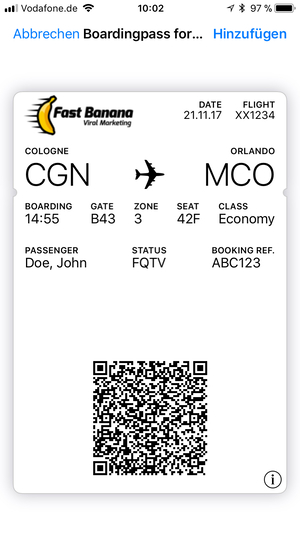
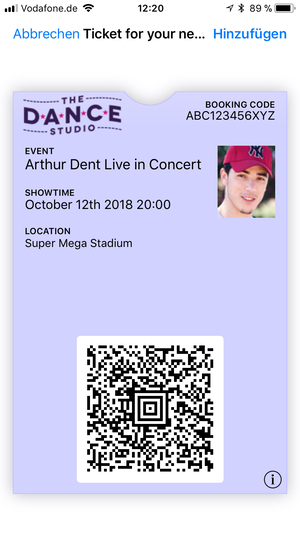
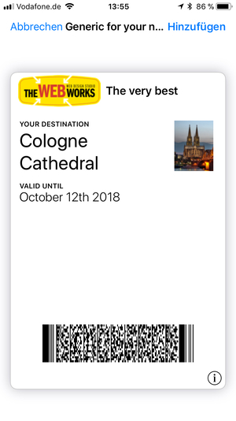

# Walletutil

Utility for creating Apple Wallet passes.

## Usage

TODO: UPLOAD ARTIFACTS TO MAVEN CENTRAL

The configuration of a pass happens by created an implementation of the `Pass` interface for which the following implementations are available (they directly correspond to the different pass styles listed at https://developer.apple.com/library/content/documentation/UserExperience/Conceptual/PassKit_PG/Creating.html):

* `de.perdian.tools.applewallet.BoardingPass`
* `de.perdian.tools.applewallet.Coupon`
* `de.perdian.tools.applewallet.EventTicket`
* `de.perdian.tools.applewallet.GenericPass`
* `de.perdian.tools.applewallet.StoreCard`

First all data that should be added to the pass must be configured via the properties in the chosen `Pass` implementation class:

    GenericPass pass = new GenericPass();
    // see below for detailed examples

After the data has been set the pass needs to be signed with your Apple certificate:

    KeyStorePassSigner passSigner = new KeyStorePassSigner();
    // Configure the signer via the setXXX methods

The bytes returned from the `Pass#toSignedPass` can then be used to download the actual pass to the customers device.

## Examples

The examples for the different types of passes can be found at `src/examples/resources` within the package `de.perdian.tools.applewallet.examples`.

### Boarding pass

      BoardingPass pass = new BoardingPass();
      pass.setPassTypeIdentifier("YOUR PASS TYPE IDENTIFIER");
      pass.setTeamIdentifier("YOUR TEAM IDENTIFIER");
      pass.setOrganizationName("YOUR ORGANIZATION NAME");
      pass.setSerialNumber("123456");
      pass.setDescription("Boardingpass for your next flight");
      pass.setTransitType(TransitType.AIR);
      pass.setHeaderFields(Arrays.asList(new TextField("flight", "Flight", "XX1234"), new DateField("date", "Date", Instant.now(), DateStyle.SHORT, DateStyle.NONE)));
      pass.setPrimaryFields(Arrays.asList(new TextField("departureAirport", "Cologne", "CGN"), new TextField("arrivalAirport", "Orlando", "MCO")));
      pass.setAuxiliaryFields(Arrays.asList(new TextField("boardingTime", "Boarding", "14:55"), new TextField("gate", "Gate", "B43"), new TextField("zone", "Zone", "3"), new TextField("seat", "Seat", "42F"), new TextField("class", "Class", "Economy")));
      pass.setSecondaryFields(Arrays.asList(new TextField("passengerName", "Passenger", "Doe, John"), new TextField("status", "Status", "FQTV"), new TextField("bookingReferences", "Booking Ref.", "ABC123")));
      pass.setBarcodes(Arrays.asList(new Barcode(BarcodeFormat.QR, "Lorem ipsum dolor sit amet, consetetur sadipscing elitr, sed diam nonumy eirmod tempor invidunt ut labore et dolore magna aliquyam erat, sed diam voluptua. At vero eos et accusam et justo duo dolores et ea rebum.")));
      pass.setExpirationDate(Instant.now().plus(100, ChronoUnit.DAYS));
      pass.setRelevantDate(Instant.now());
      pass.setIcon(Image.from(new URLDataSource(BoardingPassExample.class.getResource("logo-fast-banana.png"))));
      pass.setLogo(Image.from(new URLDataSource(BoardingPassExample.class.getResource("logo-fast-banana.png"))));

### Coupon

      Coupon pass = new Coupon();
      pass.setPassTypeIdentifier("YOUR PASS TYPE IDENTIFIER");
      pass.setTeamIdentifier("YOUR TEAM IDENTIFIER");
      pass.setOrganizationName("YOUR ORGANIZATION NAME");
      pass.setSerialNumber("123456");
      pass.setDescription("Coupon for your next purchase");
      pass.setPrimaryField(new TextField("discount", "Valid for all purchases", "50% OFF"));
      pass.setAuxiliaryFields(Arrays.asList(new TextField("validUntil", "Valid until", "October 12th 2018")));
      pass.setBarcodes(Arrays.asList(new Barcode(BarcodeFormat.PDF417, "Lorem ipsum dolor sit amet, consetetur sadipscing elitr, sed diam nonumy eirmod tempor invidunt ut labore et dolore magna aliquyam erat, sed diam voluptua. At vero eos et accusam et justo duo dolores et ea rebum.")));
      pass.setExpirationDate(Instant.now().plus(100, ChronoUnit.DAYS));
      pass.setRelevantDate(Instant.now());
      pass.setBackgroundColor(new Color(200, 200, 200));
      pass.setForegroundColor(new Color(50, 50, 0));
      pass.setLabelColor(new Color(50, 50, 0));
      pass.setIcon(Image.from(new URLDataSource(CouponExample.class.getResource("logo-beauty-box.png"))));
      pass.setLogo(Image.from(new URLDataSource(CouponExample.class.getResource("logo-beauty-box.png"))));

### Event Ticket

      EventTicket pass = new EventTicket();
      pass.setPassTypeIdentifier("YOUR PASS TYPE IDENTIFIER");
      pass.setTeamIdentifier("YOUR TEAM IDENTIFIER");
      pass.setOrganizationName("YOUR ORGANIZATION NAME");
      pass.setSerialNumber("123456");
      pass.setDescription("Ticket for your next event");
      pass.setPrimaryField(new TextField("discount", "Event", "Arthur Dent Live in Concert"));
      pass.setSecondaryFields(Arrays.asList(new TextField("time", "Showtime", "October 12th 2018 20:00")));
      pass.setAuxiliaryFields(Arrays.asList(new TextField("location", "Location", "Super Mega Stadium")));
      pass.setHeaderFields(Arrays.asList(new TextField("booking", "Booking code", "ABC123456XYZ")));
      pass.setBarcodes(Arrays.asList(new Barcode(BarcodeFormat.AZTEC, "Lorem ipsum dolor sit amet, consetetur sadipscing elitr, sed diam nonumy eirmod tempor invidunt ut labore et dolore magna aliquyam erat, sed diam voluptua. At vero eos et accusam et justo duo dolores et ea rebum.")));
      pass.setExpirationDate(Instant.now().plus(100, ChronoUnit.DAYS));
      pass.setRelevantDate(Instant.now());
      pass.setBackgroundColor(new Color(210, 210, 255));
      pass.setThumbnail(Image.from(new URLDataSource(EventTicketExample.class.getResource("person.jpg"))));
      pass.setIcon(Image.from(new URLDataSource(EventTicketExample.class.getResource("logo-the-dance-studio.png"))));
      pass.setLogo(Image.from(new URLDataSource(EventTicketExample.class.getResource("logo-the-dance-studio.png"))));

### Generic Pass

      GenericPass pass = new GenericPass();
      pass.setPassTypeIdentifier("YOUR PASS TYPE IDENTIFIER");
      pass.setTeamIdentifier("YOUR TEAM IDENTIFIER");
      pass.setOrganizationName("YOUR ORGANIZATION NAME");
      pass.setSerialNumber("123456");
      pass.setDescription("Generic for your next purchase");
      pass.setPrimaryField(new TextField("discount", "Your destination", "Cologne Cathedral"));
      pass.setSecondaryFields(Arrays.asList(new TextField("validUntil", "Valid until", "October 12th 2018")));
      pass.setBarcodes(Arrays.asList(new Barcode(BarcodeFormat.PDF417, "Lorem ipsum dolor sit amet, consetetur sadipscing elitr, sed diam nonumy eirmod tempor invidunt ut labore et dolore magna aliquyam erat, sed diam voluptua. At vero eos et accusam et justo duo dolores et ea rebum.")));
      pass.setExpirationDate(Instant.now().plus(100, ChronoUnit.DAYS));
      pass.setRelevantDate(Instant.now());
      pass.setThumbnail(Image.from(new URLDataSource(GenericPassExample.class.getResource("location.jpg"))));
      pass.setIcon(Image.from(new URLDataSource(GenericPassExample.class.getResource("logo-the-web-works.png"))));
      pass.setLogo(Image.from(new URLDataSource(GenericPassExample.class.getResource("logo-the-web-works.png"))));
      pass.setLogoText("The very best");

### Store Card

      StoreCard pass = new StoreCard();
      pass.setPassTypeIdentifier("YOUR PASS TYPE IDENTIFIER");
      pass.setTeamIdentifier("YOUR TEAM IDENTIFIER");
      pass.setOrganizationName("YOUR ORGANIZATION NAME");
      pass.setSerialNumber("123456");
      pass.setDescription("Generic for your next purchase");
      pass.setPrimaryField(new TextField("customer", "John Doe", "1234567890"));
      pass.setBarcodes(Arrays.asList(new Barcode(BarcodeFormat.QR, "Lorem ipsum dolor sit amet, consetetur sadipscing elitr, sed diam nonumy eirmod tempor invidunt ut labore et dolore magna aliquyam erat, sed diam voluptua. At vero eos et accusam et justo duo dolores et ea rebum.")));
      pass.setExpirationDate(Instant.now().plus(100, ChronoUnit.DAYS));
      pass.setRelevantDate(Instant.now());
      pass.setIcon(Image.from(new URLDataSource(StoreCardExample.class.getResource("logo-yoga-baby.png"))));
      pass.setLogo(Image.from(new URLDataSource(StoreCardExample.class.getResource("logo-yoga-baby.png"))));

## Known limitations

* All the field values and images set with the pass are non-localized, meaning that they will not change for different languages. Apple Wallet supports localizing passes but this has not yet been implemented with this API.

## Credits

* Thanks to https://github.com/pigment/fake-logos for the images used in the example passes.